# Uczenie nienadzorowane - Raport

## Ćwiczenie 1
Poeksperymentuj z innymi typami zbiorów danych (patrz: księżyce i koła poniżej) i spróbuj określić, jaki typ algorytmu klasteryzacji sprawdzi się dla nich najlepiej. Pamiętaj o sprawdzeniu parametrów dla różnych algorytmów, np.:

* k dla KMeans,
* eps dla DBSCAN,
* distance_threshold, affinity lub linkage dla AgglomerativeClustering.

### Księżyce
#### Oryginał
```
X, y = make_moons(n_samples=200, noise=0.05)
show_scatter(X)
```
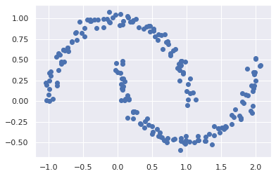

#### KMeans
```
kmeans = KMeans(n_clusters=2)
y_pred = kmeans.fit_predict(X)
centers = kmeans.cluster_centers_p
show_scatter(X, y_pred, centers)
```
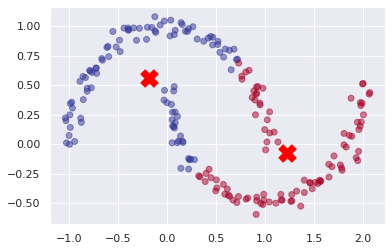

#### Ustalamy liczbę klastrów

```
km_list = list()

for k in range(1,10):
    km = KMeans(n_clusters=k)
    y_pred = km.fit(X)
    km_list.append(pd.Series({'clusters': k, 
                              'inertia': km.inertia_}))
```

```
plot_data = (pd.concat(km_list, axis=1)
             .T
             [['clusters','inertia']]
             .set_index('clusters'))

ax = plot_data.plot(marker='o',ls='-')
ax.set_xticks(range(0,10,1))
ax.set_xlim(0,10)
ax.set(xlabel='Cluster', ylabel='Inertia');
```
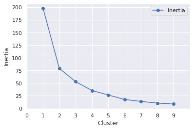

Bardzo dobrze widoczne "kolanko" przy `Cluster` = 2.

#### MeanShift
```
ms = MeanShift(cluster_all=False)
y_pred = ms.fit_predict(X)
centers = ms.cluster_centers_
show_scatter(X, y_pred, centers)
```
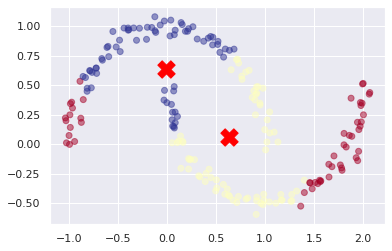

#### MeanShift z `bandwidth`

```
bandwidth = estimate_bandwidth(X, quantile=.35, n_samples=200) 
ms = MeanShift(cluster_all=False, bandwidth=bandwidth)
y_pred = ms.fit_predict(X)
centers = ms.cluster_centers_
show_scatter(X, y_pred, centers)
```

Najlepsze wyniki dla tego algorytmu obrazują następujące wykresy, odpowiednio dla\
`quantile` = 0.35\
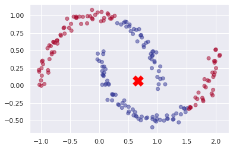\
oraz `quantile` = 0.6\
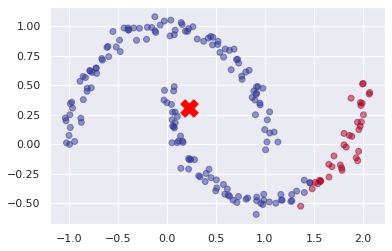\
Przy czym wynik drugi wydaje mi się lepszy, ponieważ chociaż jedna grupa jest odpowiednio przyporządkowana, podczas gdy dla pierwszego przypadku obie grupy są wymieszane.

#### DBSCAN

```
dbscan = DBSCAN(eps=0.3)
y_pred = dbscan.fit_predict(X)
show_scatter(X, y_pred)
```
Zadowalający wynik uzyskałem dla `eps` = 0.3.\
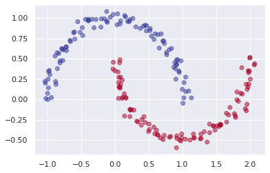

#### AgglomerativeClustering

```
ac = AgglomerativeClustering(n_clusters=None, distance_threshold=0.2, 
                             affinity='euclidean', linkage='single')
y_pred = ac.fit_predict(X)
```
Zadowalające wyniki uzyskałem dla następujących parametrów

* `distance_threshold` = 0.2, `affinity` = 'euclidean', `linkage` = 'single'
##### Wynik
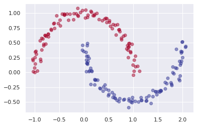
##### Dendrogram

---
* `distance_threshold` = 0.3, `affinity` = 'l1', `linkage` = 'single'
##### Wynik

##### Dendrogram
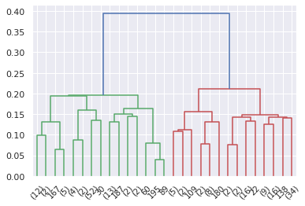
---
* `distance_threshold` = 0.2, `affinity` = 'l2', `linkage` = 'single'
##### Wynik

##### Dendrogram
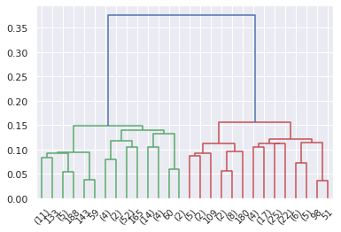
---
* `distance_threshold` = 0.25, `affinity` = 'manhattan', `linkage` = 'single'
##### Wynik

##### Dendrogram


### Koła

#### Oryginał
```
X, y = make_circles(n_samples=200, factor=0.5, noise=0.05)
show_scatter(X)
```
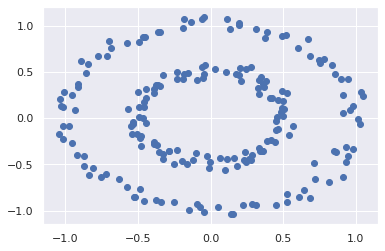

#### KMeans
```
kmeans = KMeans(n_clusters=2)
y_pred = kmeans.fit_predict(X)
centers = kmeans.cluster_centers_
show_scatter(X, y_pred, centers)
```
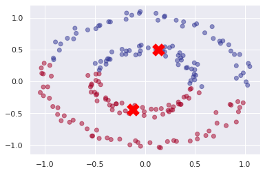

#### Ustalamy liczbę klastrów

```
km_list = list()

for k in range(1,10):
    km = KMeans(n_clusters=k)
    y_pred = km.fit(X)
    km_list.append(pd.Series({'clusters': k, 
                              'inertia': km.inertia_}))
```

```
plot_data = (pd.concat(km_list, axis=1)
             .T
             [['clusters','inertia']]
             .set_index('clusters'))

ax = plot_data.plot(marker='o',ls='-')
ax.set_xticks(range(0,10,1))
ax.set_xlim(0,10)
ax.set(xlabel='Cluster', ylabel='Inertia');
```
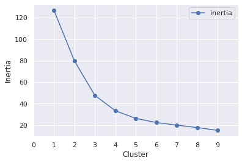
"Kolanko" przy `Cluster` = 2 niestety nie jest tak dobrze widoczne jak dla poprzedniego przypadku.
#### MeanShift
```
ms = MeanShift(cluster_all=False)
y_pred = ms.fit_predict(X)
centers = ms.cluster_centers_
show_scatter(X, y_pred, centers)
```
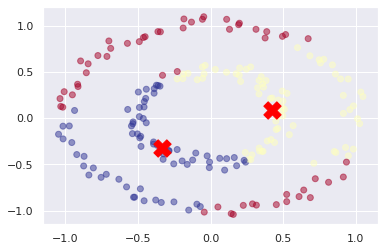

#### MeanShift z `bandwidth`

```
bandwidth = estimate_bandwidth(X, quantile=.315, n_samples=200) 
ms = MeanShift(cluster_all=False, bandwidth=bandwidth)
y_pred = ms.fit_predict(X)
centers = ms.cluster_centers_
show_scatter(X, y_pred, centers)
```

Testowałem wyniki dla różnych wartości `quantile`, najlepsze wyniki przedstawiam poniżej.\
`quantile` = 0.315\
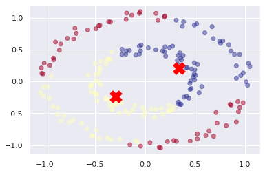\
Mamy dwa klastry, jednak są one wymieszane.

`quantile` = 0.32\
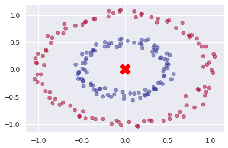\
Na piewszy rzut oka wynik wygląda zadowalająco, jednak jest tylko jeden klaster, który nie spełnia naszych wymagań.


#### DBSCAN

```
dbscan = DBSCAN(eps=0.25)
y_pred = dbscan.fit_predict(X)
show_scatter(X, y_pred)
```
Zadowalający wynik uzyskałem dla `eps` = 0.25\
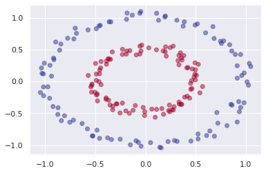

#### AgglomerativeClustering

```
ac = AgglomerativeClustering(n_clusters=None, distance_threshold=0.2, 
                             affinity='euclidean', linkage='single')
y_pred = ac.fit_predict(X)
```
Zadowalające wyniki uzyskałem dla następujących parametrów:
* `distance_threshold` = 0.2, `affinity` = 'euclidean', `linkage` = 'single'
##### Wynik

##### Dendrogram
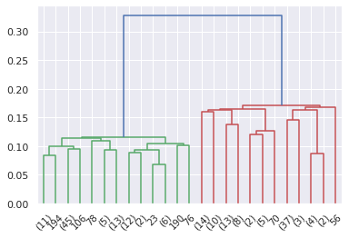
---
* `distance_threshold` = 0.3, `affinity` = 'l1', `linkage` = 'single'
##### Wynik

##### Dendrogram


---
* `distance_threshold` = 0.2, `affinity` = 'l2', `linkage` = 'single'
##### Wynik

##### Dendrogram

---
* `distance_threshold` = 0.25, `affinity` = 'manhattan', `linkage` = 'single'
##### Wynik
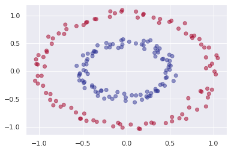
##### Dendrogram
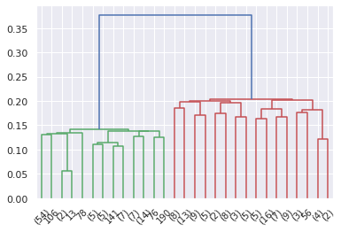

### Wnioski
W przykładach, które analizowaliśmy, algorytmy KMeans oraz MeanShift nie sprawdziły się. Jednak DBSCAN jak i AgglomerativeClustering bardzo dobrze poradziły sobie z problemem. Wartym zapamiętania jest fakt, że w każdym z poprawnych wyników algorytmu AgglomerativeClustering pojawił się ten sam rodzaj parametru `linkage`: 'single', który wykorzystuje minimum z odległości.


## Ćwiczenie 2
Klasteryzacji możemy użyć do różnych celów. Niezbyt typowym, ale możliwym jest np. kompresja kolorów obrazu.
Wybrać obraz, zredukować jego kolory do mniej niż 10 kolorów, ale w taki sposób, aby uzyskany obraz bardzo przypominał oryginalny. Należy podać nazwę obrazu, informację o liczbie kolorów, a także wkleić zarówno oryginalny, jak i skompresowany obraz.

#### Wczytujemy obraz
```
from skimage import io
cat = io.imread("kot.jpg")
ax = plt.axes(xticks=[], yticks=[])
ax.imshow(cat);
```

#### Wymiary obrazu

```
cat.shape
```
`(418, 615, 3)`

#### Przekształcamy dane i skalujemy kolory
```
data = cat / 255.0 # use 0...1 scale
data = data.reshape(418 * 615, 3)
data.shape
```
`(257070, 3)`

#### Wizualizacja pikseli
```
def plot_pixels(data, title, colors=None, N=10000):
    if colors is None:
        colors = data
    
    # choose a random subset
    rng = np.random.RandomState(0)
    i = rng.permutation(data.shape[0])[:N]
    colors = colors[i]
    R, G, B = data[i].T
    
    fig, ax = plt.subplots(1, 2, figsize=(16, 6))
    ax[0].scatter(R, G, color=colors, marker='.')
    ax[0].set(xlabel='Red', ylabel='Green', xlim=(0, 1), ylim=(0, 1))

    ax[1].scatter(R, B, color=colors, marker='.')
    ax[1].set(xlabel='Red', ylabel='Blue', xlim=(0, 1), ylim=(0, 1))

    fig.suptitle(title, size=20);
```

```
plot_pixels(data, title='Input color space: 16 million possible colors')
```
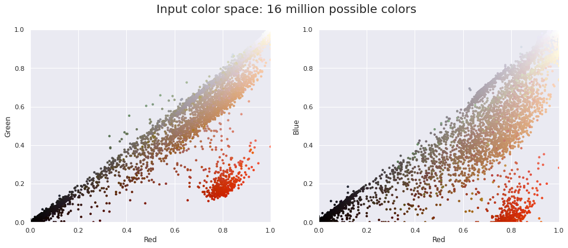

#### Redukcja liczby kolorów
Według serwisu [IMGonline.com](https://www.imgonline.com.ua/eng/unique-colors-number.php) mój obraz ma 47160 unikalnych kolorów. Zredukujemy tę liczbę do 8.

```
start = time.time()
kmeans = MiniBatchKMeans(n_clusters=8)
kmeans.fit(data)
new_colors = kmeans.cluster_centers_[kmeans.predict(data)]

plot_pixels(data, colors=new_colors,
            title="Reduced color space: 8 colors")
end = time.time()
res = end-start
```
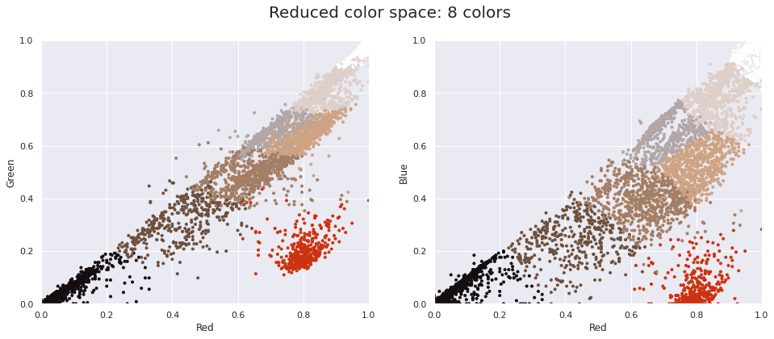

Do redukcji kolorów podszedłem dwukrotnie: 
* używając algorytmu MiniBatchKMeans\
czas: 5.3s

* używając algorytmu KMeans\
czas: 1.13s

Zdecydowana przewaga MiniBatchKMeans
#### Finalny obraz

```
cat_recolored = new_colors.reshape(cat.shape)

fig, ax = plt.subplots(1, 2, figsize=(16, 6),
                       subplot_kw=dict(xticks=[], yticks=[]))
fig.subplots_adjust(wspace=0.05)
ax[0].imshow(cat)
ax[0].set_title('Original Image', size=16)
ax[1].imshow(cat_recolored)
ax[1].set_title('8-color Image', size=16);
```


### Wnioski

Jestem bardzo zadowolony z finalnego obrazu. Wszystkie najważniejsze kolory zostały zachowane, oprócz paru "prześwietleń" na stole, utraty koloru gotówki oraz wyrazistości kawioru zdjęcie jest bardzo podobne do oryginału.


## Ćwiczenie 3

Odpowiedzieć i uzasadnić (na bazie odpowiednich wykresów lub wyników algorytmów zamieszczonych w raporcie), która/e kolumna/e ze zbioru danych mergedcustomers.csv silnie wpływa/ją na podziały na klastry, jak również zamieścić przykład klastrowania, w którym uzyskano w miarę dobre rozróżnienie klientów ze względu na ryzyko Low/High (z uzasadnieniem).

### Modyfikując wartości parametrów algorytmu `distance_threshold` -- odległość i `affinity` -- typ metryki: 'manhattan' lub 'euclidean', ew. `linkage`, wybierz parametry, które Twoim zdaniem najlepiej odwzorowują rzeczywiste wartości. Wyniki umieść w swoim raporcie.

```
from sklearn.cluster import AgglomerativeClustering
ac = AgglomerativeClustering(n_clusters=None, distance_threshold=11000, 
                             affinity='euclidean', linkage='ward')
predicted = ac.fit_predict(df_churn.values)
```
Biorąc pod uwagę fakt, że uczenie nienadzorowane nie będzie najlepszym predykatorem w takim przypadku oraz stosując metodę prób i błędów, udało mi się uzyskać w miarę zadowalający wynik.
Parametry:
* ` distance_threshold` = 11000 
* `affinity` = 'euclidean'
* `linkage` = 'ward'
### Wyniki

#### Ocena zewnętrzna
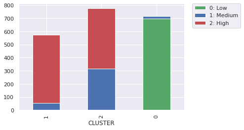
#### Dendrogram
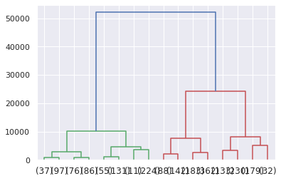
#### Wizualizacja 3D
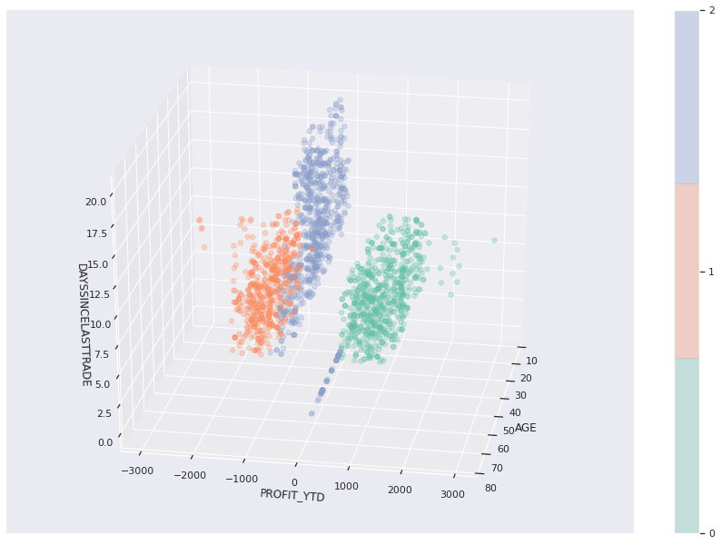

Jak widać na wykresie, który dotyczy oceny zewnętrznej, klienci niskiego ryzyka zostali bardzo dobrze dopasowani, podobnie jak klienci z grupy wysokiego ryzyka. Problem pojawia się w środkowym słupku, w którym klienci wysokiego i średnioego ryzyka zostali złączeni, jednak nie udało się uzyskać lepszego wyniku. Może być to związane z faktem, o którym wspomniałem na początku - uczenie nienadzorowane nie będzie najlepszym predykatorem.


### Która kolumna ze zbioru danych `mergedcustomers.csv` silnie wpływa na podział na klastry?

Na podział na klastry bardzo silnie wpływa kolumna `PROFIT_YTD`, co jest szczególnie widoczne na poniższym wykresie. Zauważyć można bezpośredni związek między `PROFIT_YTD` a ryzykiem (kolory kropek zmieniające się wraz ze zmianą `PROFIT_YTD`)
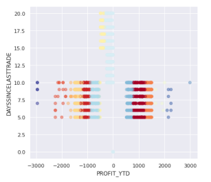


