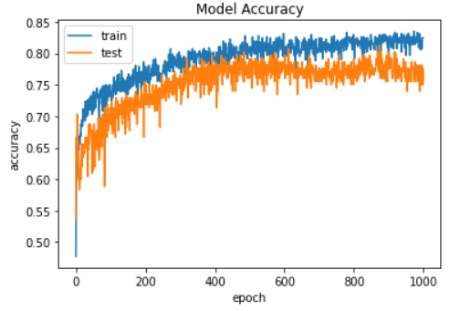

Imię i nazwisko: Szymon Klempert\
Grupa (godzina, tydzień): 16:00, (chyba) drugi

## Podstawy Sztucznej Inteligencji
# Uczenie Nadzorowane – Sprawozdanie


## Część 1:
### Czym różnią się uczenie nadzorowane, uczenie nienadzorowane i uczenie ze wzmocnieniem?

- Uczenie nadzorowane opiera się na przykładach, działamy na danych wejściowych i wyjściowych, które posiadają odpowiednie etykiety i na nich trenujemy model.

- W uczeniu nienadzorowanym nie dostarczamy przykładowych odpowiedzi, model sam próbuje znaleźć jakąś korelację między danymi i nadać im odpowiednie etykiety.

- W uczeniu ze wzmocnieniem dostarczamy modelowi tylko zbiór możliwych działań i reguł. Z każdym krokiem model otrzymuje informacje zwrotną z poprzedniego kroku i na podstawie doświadczen i nagród uczy się.

### Czym różni się regresja od klasyfikacji?

- Klasyfikacja przewiduje nieuporządkowane dane i mapuje je na dyskretne etykiety klas, a regresja przewiduje dane uporządkowane i mapuje je na ciągłe wartości.

### Co to jest regresja liniowa, drzewo decyzyjne i sieć neuronowa?

- Regresja liniowa jest metodą statystyczną pozwalająca ocenić wpływ wielu różnych cech (nazywanych zmiennymi objaśniającymi) na pewną cechę, która szczególnie nas interesuje (nazywaną zmienną objaśnianą). Zakłada ona, że zależność pomiędzy nimi jest zależnością liniową. Funkcja regresji przyjmuje postać funkcji liniowej.

- Drzewo decyzyjne to metoda, która jest graficznym zapisem analizy problemu przypominającyn drzewo. Służy dokonaniu właściwego wyboru i podjęciu decyzji z pełną świadomością jej skutków. Jest sposobem zobrazowania algorytmu, który opiera się na conditional'ach.

- Sieci neuronowe są częścią funkcji uczenia maszynowego i stanowią podstawę algorytmów uczenia głębokiego. Ich nazwa i struktura są wzorowane na ludzkim mózgu i naśladują sposób, w jaki biologiczne neurony komunikują się między sobą. Każde połączenie, tak jak synapsa w mózgu, może przekazać sygnał(liczbę rzeczywistą) dalej.

### Czym jest zbiór testowy a czym zbiór uczący?
- Zbiór uczący - zbiór danych używane do nauki algorytmu. Na ich podstawie model uczy się klasyfikować i buduje zależności.

-  Zbiór testowy - zbiór służący do przetestowania modelu. Dane te nie mogą być użyte do nauczenia czy walidacji modelu, ponieważ chcemy wiedzieć jak model poradzi sobie z danymi, z którymi nigdy nie miał styczności. Powinien być również idealnie przygotowany, bez jakichkolwiek błędów.

### Na czym polega overfitting a na czym underfitting?
- Overfitting polega na pobieraniu danych treningowych i uczeniu się z nich w pełni, nie dokonując uogólnień na zbiorze testowym. Oznacza to, że uzyskujemy dobrą dokładność w zbiorze uczącym, ale model działa słabo na danych, których wcześniej nie widział.

- Underfitting polega sytuacji, kiedy model nie uczy się ważnych parametrówi relacji między danymi wejściowymi a wyjściowymi dla predykcji na zbiorze testowym, co powoduje duży błąd.

### Jak radzić sobie z overfittingiem w przypadku regresji liniowej, drzew decyzyjnych i sieci neuronowych?

- Zebranie większej ilości danych
- Dropout - losowe usuwanie z sieci pojedynczych neuronów w trakcie uczenia
- Regularyzacja - dodatkowy termin dodawany do funkcji straty w celu nałozenia kary na wagi parametrów dużych sieci w celu zmniejszenia przepełnienia.
- Rozszerzanie - sztuczne modyfikowanie istniejących danych za pomocą przekształceń, które przypominają zmienność, której można się spodziewać w rzeczywistych danych.
- Wczesne zatrzymanie 

### Czym jest Eksploracyjna Analiza Danych (EDA) i po co się ją wykonuje?
- Eksploracyjna analiza danych (EAD, ang. exploratory data analysis) to proces mający na celu zrozumienie charakterystyki danych przy użyciu technik wizualizacji oraz metod statystyki opisowej. Podczas pracy z nowym zbiorem danych powinno się poddać go analizie polegającej na interaktywnej pracy z danymi, której celem jest zaproponowanie możliwych hipotez do późniejszej weryfikacji. Taka wiedza pozwala na wybranie właściwych metod dalszej analizy statystycznej.

### Czym jest outlier?
- Outlier to obserwacja, która leży relatywnie daleko od pozostałych elementów losowej próby. Przed wyróżnieniem outlierów, należy scharakteryzować "normalne" obserwacje.

### Jakie metryki można stosować do mierzenia skuteczności działania modelu w uczeniu nadzorowanym i jaka jest ich interpretacja? Wymień przynajmniej 4.
- **Precision = True Positive / (True Positive + False Positive)**

Metryka mówi nam o tym, w jakim stopniu klasyfikacje pozytywne na podstawie modelu są poprawne
 
- **Recall = True Positive / (True Positive + False Negative)** 

Metryka mówi nam o zdolności modelu do wychwytywania przypadków pozytywnych

- **F1**

 

Jest to średnia harmoniczna z Recall i Precision.

- **Specificity = True Negative Rate = True Negative/(True Negative + False Positive)**

Metryka opisująca zdolność modelu do wychwytywania przypadków negatywnych

- **Accuracy = (TP+TN)/(TP+TN+FP+FN)**

Metryka mówi o odsetku poprawnych klasyfikacji dokonywanych przez model.

- **AUC - Area under the ROC Curve**

Metryka oceny AUC jest obliczana jako obszar pod krzywą ROC (ocena poprawności klasyfikatora) i jest skalarną reprezentacją oczekiwanej wydajności klasyfikatora. Współczynnik AUC zawsze ma wartość z przedziału od 0 do 1, przy czym wyższe wartości reprezentują lepszy klasyfikator. 


### Czym jest walidacja krzyżowa?
Walidacja krzyżowa to sposób przygotowania zestawów treningowych i testowych dla modelu. Polega na podzieleniu zestawu danych na podzestawy i stworzeniu z nich zestawów danych testowych i treningowych. Przykładem walidacji krzyżowej jest walidacja k-krotną, która polega na podzieleniu zestawu danych na k podzestawów i następnie kolejno braniu jednego z nich jako zestaw danych testowych, używając reszty jako zestawów danych treningowych. Oceną dokładnośći modelu jest średnia arytmetyczna wszystkich k testów.

## Część 4:
### Jaki jest rozmiar zbioru danych? Podaj wszystkie wymiary!
```py
print(df.shape)
```
>(6, 7) 

Rozmiar danych to 6 x 7

### Ile atrybutów występuje w zbiorze danych? Które z nich to cechy? Czym są pozostałe? Czym jest zmienna zależna i niezależna?

```py
print(df.columns)
print(len(df.columns))
```
>Index(['sky', 'airTemp', 'humidity', 'wind', 'water', 'forecast', 'enjoy'], dtype='object') \
>7 

W zbiorze występuje 7 atrybutów. Wśród nich cechy to: 'sky', 'airTemp', 'humidity', 'wind', 'water', 'forecast'. Ostatni atrybut to 'enjoy' i jest to etykieta. Zmienna zależna jest zmienną, której dokonujemy pomiaru, i której wartość jest uzależniona od wartości zmiennej niezależnej. Zmienna niezależna jest zmienną, którą manipulujemy.

### Ile jest wszystkich instancji? Ile jest instancji pozytywnych (enjoy==yes) a ile negatywnych?

```py
#Ile jest wszystkich instancji?
print(len(df["enjoy"]))
# Ile jest instancji pozytywnych `(enjoy==yes)`?
print(len(df[df["enjoy"] == 'yes']))
```
>6\
4

Negatywne: 6-4=2\
Wszystkich instancji jest 6, z czego 4 są pozytywne, a 2 negatywne.
### Który z atrybutów najlepiej rozdziela dane względem enjoy?
Po przygotowaniu i przeanalizowaniu wykresów dla kolejnych atrybutów, najlepiej dane rozdziela `airTemp`.
```py
### dla airTemp
df.head(5)
df['color'] = df['airTemp']
df['color'] = df['color'].replace('warm', 'red')
df['color'] = df['color'].replace('cold', 'blue')
df.head(5)
### dla airTemp
#df.plot.scatter(x='airTemp', y='humidity', c='color')
#df.plot.scatter(x='airTemp', y='wind', c='color')
#df.plot.scatter(x='airTemp', y='water', c='color')
df.plot.scatter(x='airTemp', y='enjoy', c='color')
```


### Ile elementów ze zbioru danych ma atrybut wilgotność ustawiony jako wysoki (humidity==high)? Jakie mają numery w zbiorze danych (liczymy od 0)?
```py
print(len(df[df['humidity'] == 'high']))
print(df[df['humidity'] == 'high'].index.tolist())
```
>4\
[1, 2, 3, 5]

4 elementy ze zbioru danych ma atrybut wilgotność ustawiony jako wysoki, mają numery: 1, 2, 3, 5.


## Część 5:
### Czym te zbiory danych się różnią?
```py
print(cpu_vendor.head(10))
print(cpu.head(10))
```

``` 
   MYCT  MMIN   MMAX  CACH  CHMIN  CHMAX  class
0   125   256   6000   256     16    128    198
1    29  8000  32000    32      8     32    269
2    29  8000  32000    32      8     32    220
3    29  8000  32000    32      8     32    172
4    29  8000  16000    32      8     16    132
    vendor  MYCT  MMIN   MMAX  CACH  CHMIN  CHMAX  class
0  adviser   125   256   6000   256     16    128    199
1   amdahl    29  8000  32000    32      8     32    253
2   amdahl    29  8000  32000    32      8     32    253
3   amdahl    29  8000  32000    32      8     32    253
4   amdahl    29  8000  16000    32      8     16    132
```

Zbiór cpu_vendor ma jedną kolumnę tj. atrybut więcej `vendor` oraz występują różnice w wartościach kolumny `class`
### Jaki typ ma seria danych vendor a jaki class?
```py
print(cpu_vendor['vendor'].dtype)
print(cpu_vendor['class'].dtype)
```
>object\
int64

Seria danych vendor ma typ `object`, a class `int64`

### Co się stało po użyciu funkcji pd.get_dumies()?
```py
cpu_vendor['vendor'] = pd.get_dummies(cpu_vendor['vendor'])
```
Po użyciu funkcji pd.get_dummies() pojawił się błąd:
> ValueError: Columns must be same length as key


### Umieść kod dla regresji liniowej – od momentu wczytania danych.
```py
import numpy as np
from sklearn.linear_model import LinearRegression

cpu = pd.read_csv(r'data\cpu.csv')
cpu_vendor = pd.read_csv(r'data\cpu-vendor.csv')

model = LinearRegression()
x = cpu.drop(columns=['class'])
y = cpu['class']
model.fit(x, y)
score = model.score(x, y)
print("Score cpu:", score)

#vendor
cpu_vendor_dummies = pd.get_dummies(cpu_vendor['vendor'])
data = pd.concat([cpu_vendor_dummies, cpu_vendor.drop(columns=['vendor'])], axis=1)

x_vendor = data.drop(columns=['class'])
y_vendor = data['class']


model_vendor = LinearRegression()
model_vendor.fit(x_vendor, y_vendor)
score_vendor = model_vendor.score(x_vendor, y_vendor)
print("Score cpu_vendor:", score_vendor)
```
>Score cpu: 0.8648906922768672\
Score cpu_vendor: 0.929226077788117

### Jak wyglądają współczynniki regresji? Zinterpretuj je (jeśli… to…).
- cpu

```py
print('intercept:', model.intercept_)
print('slope:', model.coef_)
```
```
intercept: -55.89393360702407
slope: [ 0.0488549   0.01529257  0.00557139  0.64140143 -0.27035755  1.48247217]
```


- cpu_vendor

```py
print('intercept:', model_vendor.intercept_)
print('slope:', model_vendor.coef_)
```
```
intercept: -70.63880112904427
slope: [-1.20152953e+02 -1.48239022e+00  2.84413532e+01 -1.09132852e+01
  1.65327404e+01 -2.25179136e+01  3.36762519e+01  2.26853409e+01
  1.09633351e+01  1.47719779e+01  2.27795977e+01 -5.80161222e+00
  4.67541141e+01 -4.14901873e+01  1.18964838e+00 -2.40890874e+01
  1.63839660e+01 -6.93746550e+00  8.75855106e-01  1.39006691e+01
 -1.28899937e+02 -1.47169131e+01  4.43247470e-01  2.71635048e+01
  2.55616541e+01  2.44172510e+01 -2.38837401e+00  5.21606241e+01
  4.77628052e+00  1.59127070e+01  7.14227831e-02  1.73667215e-02
  5.50390047e-03  6.43157128e-01 -1.52144498e+00  1.58663686e+00]
```
Intercept to punkt przecięcia z osią OY (współrzędna X) \
Slope to współczynniki równania
## Część 6:
### Wklej cały kod dla przykładu ze swimming.
```py
from sklearn import tree
from IPython.display import Image
import pydotplus

clf_entropy = tree.DecisionTreeClassifier(criterion='entropy')
clf_gini = tree.DecisionTreeClassifier(criterion='gini')

print(df)

x = pd.get_dummies(df.drop('enjoy', axis=1))
y = pd.get_dummies(df['enjoy'])
print(x)
print(y)
clf = clf_gini
clf = clf.fit(x, y)
#clf2 = clf_entropy
#clf2 = clf2.fit(x, y)

pd.get_dummies(df.drop('enjoy', axis=1))

from IPython.display import Image
import pydotplus

columns = pd.get_dummies(df.drop('enjoy', axis=1)).columns

dot_data = tree.export_graphviz(clf, out_file=None, rounded=True, filled=True, feature_names=columns)
graph = pydotplus.graph_from_dot_data(dot_data)
Image(graph.create_png())

#dot_data2 = tree.export_graphviz(clf2, out_file=None, rounded=True, filled=True, feature_names=columns)
#graph2 = pydotplus.graph_from_dot_data(dot_data2)
#Image(graph2.create_png())
```

### Czy w przypadku iris konieczne jest przekodowanie? Dlaczego tak/nie?
Przekodowanie jest konieczne tylko dla kolumny class, ponieważ reszta klas posiada wartości w postaci liczb rzeczywistych

### Za co odpowiadają parametry max_depth, min_samples_split, min_samples_leaf?
- `max_depth` - maksymalna głębokość w drzewie
- `min_samples_split` - wymagana minimalna liczba próbek, aby podzielić wewnętrzny node
- `min_samples_leaf` - minimalna liczba próbek wymaganych w liściu

### Umieść graficzne reprezentacje drzew dla iris (przynajmniej 1 na modyfikowany parametr – podaj wartości).
- clf_gini = tree.DecisionTreeClassifier(criterion='gini', min_samples_split=5)


- clf_gini = tree.DecisionTreeClassifier(criterion='gini', min_samples_leaf=4)


- clf_gini = tree.DecisionTreeClassifier(criterion='gini', max_depth=2)


## Część 7:
### Wklej rysunki 2 neuronów dla AND i OR.


### Wklej zrzuty ekranu wyuczonych sieci dla 4 datasetów ze wskazanej strony.


### Do czego służy funkcja train_test_split()? Po co ją wykorzystujemy?
Funkcja `train_test_split()` dzieli array'e lub macierze na losowe zestawy treningowe i testowe.
Używamy jej, żeby z zestawu danych otrzymać zbiory testowe i trenigowe, dzięki którym będziemy w stanie ocenić skuteczność naszej sieci.

### Z ilu warstw składa się utworzona sieć? Która funkcja odpowiada za dodawanie warstw?
Utworzona sieć składa się z 3 warstw, funkcja odpowiadająca za dodawanie warst to .add() wywołana na modelu.

### Co oznacza batch_size? Czym jest liczba epok? Ile wynoszą te parametry w naszym przykładzie?
- `BATCH_SIZE` oznacza liczbę próbek, które podawane są jednocześnie, po czym następuje aktualizacja sieci, dla naszego przykładu to 16
- `NB_EPOCHS` oznacza liczbę powtórzeń uczenia całym zbiorem danych treningowych, dla naszego przykładu to 1000


### Jakie funkcje aktywacji zastosowano? Czym jest funkcja aktywacji?
Zastosowaliśmy dwie funkcje aktywacji, `ReLU` (rektyfikowana jednostka liniowa) oraz `sigmoid`.
Funkcja aktywacji to funkcja, według której obliczana jest wartość wyjścia neuronów sieci neuronowej po agregacji danych wejściowych z uwzględnieniem wag.

## Część 8:
### Uzasadnij poprzez zamieszczenie wykresu i odpowiedz na pytania:
- Czy mamy do czynienia ze zjawiskiem overfittingu lub underfittingu czy nie ma problemów?
- Ile procent przypadków zostało poprawnie zaklasyfikowanych?



- Mamy do czynienia z overfittingiem, skuteczność modelu spada, kiedy ma do czynienia ze zbiorem testowym. Kiedy na zbiorze treningowym osiągamy ~81% poprawnie zaklasyfikowanych przypadków, na zbiorze testowym mamy już tylko ~76%. Z kolejnymi epokami skuteczność nie poprawia się, a pod sam koniec nawet spada.

### Czy to dobry wynik? Odnieś się do skuteczności modelu, gdyby ten strzelał.
Według mnie skuteczność na poziomie 76% to całkiem dobry wynik. Jeśli założymy, że model strzela zawsze w 0 jako outcome, wtedy osiągamy 65% skuteczności [768 przypadków w zbiorze danych, 500 to 0], co nie jest satysfakcjonującym wynikiem.

### Zastosuj inne metryki (przynajmniej 2) i zaprezentuj rezultaty.

Zastosowałem metryki `Precision`, `Recall` i `AUC`

Epoch 1000/1000
36/36 [==============================] - 0s 3ms/step - loss: 0.3981 - precision: 0.7566 - recall: 0.6942 - auc: 0.8920 - Accuracy: 0.8108 - val_loss: 0.4898 - val_precision: 0.6923 - val_recall: 0.4355 - val_auc: 0.8350 - val_Accuracy: 0.7552


